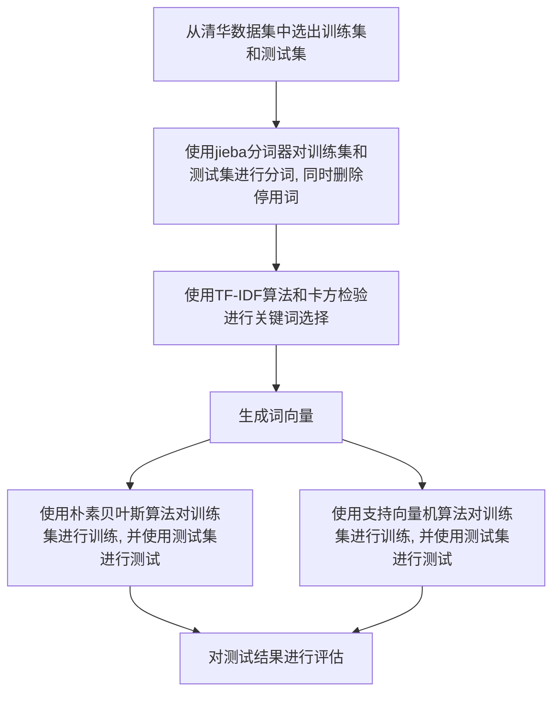

# 实验一：文本数据的分类与分析 <!-- omit in toc -->

- [实验目的](#实验目的)
- [实验要求](#实验要求)
- [实验内容](#实验内容)
- [实验分工](#实验分工)
- [实验环境](#实验环境)
- [主要设计思想](#主要设计思想)
  - [TF-IDF 算法](#tf-idf-算法)
  - [卡方检验](#卡方检验)
  - [朴素贝叶斯](#朴素贝叶斯)
  - [支持向量机](#支持向量机)
  - [性能评估方法](#性能评估方法)
- [实验过程](#实验过程)
  - [创建数据集](#创建数据集)
  - [数据预处理](#数据预处理)
  - [创建词典](#创建词典)
  - [生成词向量](#生成词向量)
  - [朴素贝叶斯](#朴素贝叶斯-1)
    - [训练阶段](#训练阶段)
    - [测试阶段](#测试阶段)
    - [性能评估](#性能评估)
  - [支持向量机](#支持向量机-1)
    - [训练和测试](#训练和测试)
    - [参数调整](#参数调整)
    - [性能评估](#性能评估-1)
  - [评估函数](#评估函数)
- [总结和反思](#总结和反思)

## 实验目的

1. 掌握数据预处理的方法, 对训练集进行;
2. 掌握文本建模的方法, 对语料库档进行;
3. 掌握分类算法的原理, 基于有监督的机器学习方法训练文本分类器 ;
4. 利用学习的文本分类器, 对未知文本进行分类判别;
5. 掌握评价分类器性能的估方法.

## 实验要求

1. 文本类别数: 10 类;
2. 训练集文档数: >=50000 篇；每类平均 5000 篇;
3. 测试集文档数: >=50000 篇；每类平均 5000 篇;
4. 分组完成实验: 组员数量<=3,个人实现可以获得实验加分.

## 实验内容

利用分类算法实现对文本的数据挖掘, 主要包括:

1. 语料库的构建, 主要包括利用爬虫收集 Web 文档等;
2. 语料库的数据预处理, 包括文档建模, 如去噪, 分词, 建立数据字典, 使用词袋模型或主题模型表达文档等;

    > 注: 使用主题模型, 如 LDA 可以获得实验加分;

3. 选择分类算法(朴素贝叶斯/SVM/其他等), 训练文本分类器, 理解所选的分类算法的建模原理、实现过程和相关参数的含义;
4. 对测试集的文本进行分类;
5. 对测试集的分类结果利用正确率和召回率进行分析评价: 计算每类正确率、召回率, 计算总体正确率和召回率, 以及 F-score.

## 实验分工

没有组队, 所有步骤均由本人独立完成.

## 实验环境

-   操作系统: Windows10 64 位, Ubutun 20.04 LTS _(分词时间较长, 所以在实验时放到服务器上运行)_
-   Python 环境: Python 3.9.7
-   数据集来源: [中文文本分类数据集 THUCNews](http://thuctc.thunlp.org/#%E4%B8%AD%E6%96%87%E6%96%87%E6%9C%AC%E5%88%86%E7%B1%BB%E6%95%B0%E6%8D%AE%E9%9B%86THUCNews)
-   分词工具: jieba
-   分类工具：
    -   手写实现朴素贝叶斯
    -   支持向量机: sklearn.svm

## 主要设计思想



### TF-IDF 算法

本次实验使用 TF-IDF 进行特征提取.词频(term frequency, TF), 指的是某一个给定的词语在该文件中出现的频率.

$$TF_{i, j} = \frac{n_{i, j}}{\sum_{k}n_{k, j}}$$

上式中 $n_{i,j}$ 表示第 $j$ 篇文章中出现第 $i$ 个词的频数, 而 $\sum_{k}n_{k,j}$ 表示统计第 $j$ 篇文章中所有词的总数.

逆向文件频率(inverse document frequency, IDF), 某一特定词语的 IDF, 可以由一类文件中的总文件数目除以该类中包含该词语之文件的数目, 再将得到的商取对数得到. IDF 是一个词语普遍重要性的度量.

$$IDF_{i} = \log\frac{\left| D \right|}{\left| \left\{ j: t_{i} \in d_{j} \right\} \right|}$$

上式中 $D$ 表示一个文档的集合, 有 $\left\{ d_1, d_2, d_3, \cdots \right\} \in D$, 取模即是计算这个集合中文档的个数. $t_{i}$ 表示第 $i$ 个词, $j: t_{i} \in d_{i}$ 表示第 $i$ 个单词属于文本 $d_j$, 对其取模即是计算包含单词 $i$ 的文本的个数.

TF-IDF 值即是 TF 值与 IDF 值之积. TF-IDF 综合表征了该词在文档中的重要程度和文档区分度.

### 卡方检验

卡方检验, 是用途非常广的一种假设检验方法, 它在分类资料统计推断中的应用, 包括两个率或两个构成比比较的卡方检验; 多个率或多个构成比比较的卡方检验以及分类资料的相关分析等. 卡方检验表现了该词与文本的相关程度, 本实验中使用卡方检验来进行关键词选择.

卡方检验表格:

|                  | 属于该类别 | 不属于该类别 | 共计 |
| ---------------- | ---------- | ------------ | ---- |
| 文本中包含该词   | a          | b            | a+b  |
| 文本中不包含该词 | c          | d            | c+d  |
| 共计             | a+c        | b+d          | n    |

计算卡法公式为:

$$\chi^{2} = \frac{(a + b + c + d) \times (a \times d - b \times c)^{2}}{(a + c) \times (b + d) \times (a + b) \times (c + d)}$$

实验中的代码实现见 [创建词典](#创建词典)

### 朴素贝叶斯

朴素贝叶斯法(Naive Bayes model)是基于贝叶斯定理与特征条件独立假设的分类方法, 朴素贝叶斯分类器的公式为:

$$\nu_{NB} = \argmax_{v_{j} \in V}P{v_j}\Pi_{i}P(a_{i} | v_{j})$$

朴素贝叶斯的训练公式为:

$$P(A_{i} | C) = \frac{N_{ic}}{N_c}$$

但是如果使用上述公式的话则会出现一个条件概率为零, 整个结果将变成 0 的问题, 所以需要对公式进行修正, 共有两种修正方法:

-   Lapalace

    $$P(A_{i} | C) = \frac{N_{ic} + 1}{N_c + c}$$

    > c: 类别总数

-   m-estimate

    $$P(A_{i} | C) = \frac{N_{ic} + mp}{N_c + m} = \frac{N_{ic} + 1}{N_c + \left| Vocabulary \right|}$$

本实验中的代码实现见 [朴素贝叶斯](#朴素贝叶斯)

### 支持向量机

我们使用的 SVM(Support Vector Machine)分类算法, 它是最大 margin 分类算法中的一种. SVM 是一种可训练的机器学习方法, 在小样本中可以得到优秀的训练模型.


如上图所示, SVM 分类算法可以根据最边界的样本点, 也就是支持向量, 达到二分类的目的. 当数据的样本线性不可分时, 会通过核函数的映射, 把样本转换到线性可分的向量空间. 所以核函数的选择也会影响最终的效果. 如果遇到了多分类的问题, 可以通过多个 SVM 训练模型完成多分类的任务.

此外, SVM 与 logistic regression 非常相似. Logistic regression 虽然其名字当中是 regression 也就是回归, 但是实际上此算法是一个分类算法. 为了达到性能和效率兼备, 对不同情况运用不同算法的场景进行了描述:

> n 为特征的数量，m 为训练样本的数量
> (1) 如果 n 相对 m 大很多, 可以使用 logistic regression 或者使用 SVM, 核函数选择线性核函数;
> (2) 如果 n 很小, m 的大小适中, 使用 SVM, 核函数选择 Gaussian 函数;
> (3) 如果 n 很小, m 很大, 需要添加更多的特征, 然后使用 logistic regression 或者使用 SVM, 不使用核函数.

本实验中的代码实现见 [支持向量机](#支持向量机)

### 性能评估方法

在机器学习领域, 混淆矩阵(Confusion Matrix), 又称为可能性矩阵或错误矩阵. 混淆矩阵的结构一般如下图的表示的方法:


混淆矩阵要表达的含义：

-   每一列代表了预测类别, 每一列的总数表示预测为该类别的数据的数目;
-   每一行代表了数据的真实归属类别, 每一行的数据总数表示该类别的数据实例的数目;

混淆矩阵的四个值含义:

-   True Positive(TP): 真正类. 样本的真实类别是正类, 并且模型识别的结果也是正类;
-   False Negative(FN): 假负类. 样本的真实类别是正类, 但是模型将其识别为负类;
-   False Positive(FP): 假正类. 样本的真实类别是负类, 但是模型将其识别为正类;
-   True Negative(TN): 真负类. 样本的真实类别是负类, 并且模型将其识别为负类.

正确率: 表示模型识别为正类的样本中, 真正为正类的样本所占比例, 公式为 $Precision = \frac{TP}{TP + FP}$

召回率: 召回率表现出在实际正样本中, 分类器能预测出多少, 公式为 $Recall = \frac{TP}{TP + FN}$

F1 Score: 综合了正确率和召回率, 公式为 $F1 = \frac{2 \times Precision \times Recall}{Precision + Recall}$

本实验中的代码实现见 [评估函数](#评估函数)

## 实验过程

### 创建数据集

本次实验使用 [中文文本分类数据集 THUCNews](http://thuctc.thunlp.org/#%E4%B8%AD%E6%96%87%E6%96%87%E6%9C%AC%E5%88%86%E7%B1%BB%E6%95%B0%E6%8D%AE%E9%9B%86THUCNews), 选取原始数据集中的 `['财经', '房产', '社会', '时尚', '教育', '科技', '时政', '体育', '游戏', '娱乐']` 这十个类别, 每个类别按顺序选取**8000**篇训练集和**5000**篇测试集.

```python
def create_datasets(src, train_dir, test_dir: str, train_size, test_size: int):
    for class_name in constants.class_list:
        dir_path = src + class_name
        file_list = os.listdir(dir_path)
        print(class_name + ':' + str(len(file_list)))

        if not os.path.exists(train_dir + class_name):
            os.makedirs(train_dir + class_name)
        for i in range(train_size):
            shutil.copy(dir_path + '/' + file_list[i], train_dir + class_name + '/' + str(i) + '.txt')

        if not os.path.exists(test_dir + class_name):
            os.makedirs(test_dir + class_name)
        for i in range(train_size, train_size + test_size):
            shutil.copy(dir_path + '/' + file_list[i], test_dir + class_name + '/' + str(i - train_size) + '.txt')
```

数据集示例:


### 数据预处理

-   使用`jieba`分词器对文本进行分词, 并且开启了`jieba`的`paddle`模式, 使分词结果更加准确;
-   将一个类的分词结果存储到一个文件中, 一行代表一个文本的分词结果, 方面后续操作;
-   除了老师给出的停用词外我又从网上搜集了一些中文停用词 _(共 943 个)_ 和停用符号 _(共 77 个)_.

```python
def del_stop_words(src, out: str):
    """
    删除停用词
    并将同一类的数据整合到一个文件中, 方便后续处理

    src: 待处理文件路径
    out: 处理后文件路径
    """
    # 整个数据集分词后整合的结果
    _all = ''
    for class_name in constants.class_list:
        print(f'正在处理 {class_name} 类')

        if not os.path.exists(src + class_name):
            raise Exception(f'{src + class_name}  文件夹不存在')

        if not os.path.exists(out + class_name):
            os.makedirs(out + class_name)

        # 单个种类分词并合成整合
        all_single = ''
        for _file in os.listdir(src + class_name):
            single = ''
            with open(src + class_name + '/' + _file, 'r', encoding='utf-8') as f:
                lines = f.read()
                words = ps.cut(lines, use_paddle=True)
                for word, flag in words:
                    # 若为名词且不在停用词表中，则加入写入串
                    if flag == 'n' and not is_stop_word(word):
                        single += (word + ' ')
                all_single += single + '\n'

        with open(out + class_name + '/all.txt', 'w', encoding='utf-8') as f:
            f.write(all_single)

        _all += all_single

    with open(out + '/all.txt', 'w', encoding='utf-8') as f:
        f.write(_all)
```

停用词和停用符号:


分词后的文本示例:


### 创建词典

-   将每个类的词典保存到二进制文件中, 方便存储和读入;
-   对每个类中词频大于 30 的词计算 TF-IDF 值, 并且将其和这些词的卡方相乘得到新的权值, 选取权值前 1000 的词组成关键词表;
-   删除第二步得到的关键词表中在三个及以上类别中出现过的词, 并将最后得到的关键词表存储成二进制文件. <!-- todo 待定-->

```python
def init_word_counters(path, output: str) -> (dict, dict):
    """
    初始化每个分类的词典和词频统计器
    """
    words = {}
    words_cnt = {}

    for class_name in constants.class_list:
        with open(path + class_name + '/all.txt', 'r', encoding='utf-8') as file:
            words[class_name] = ''.join(file.readlines())
            words_cnt[class_name] = Counter(words[class_name].split())

        if not os.path.exists(output + class_name):
            os.makedirs(output + class_name)

        with open(output + class_name + '/tf.pkl', 'wb') as file:
            pickle.dump(dict(words_cnt[class_name]), file)

    return words, words_cnt

def calculate_chi_square(data_path, word, class_str: str):
    """
    计算卡方统计量
    """
    a = 0
    b = 0
    c = 0
    d = 0

    for class_name in constants.class_list:
        with open(data_path + class_name + '/all.txt', 'r', encoding='utf-8') as file:
            lines = file.readlines()

            if class_name == class_str:
                for line in lines:
                    if word in line.split():
                        a += 1
                    else:
                        c += 1
            else:
                for line in lines:
                    if word in line.split():
                        b += 1
                    else:
                        d += 1

    if b == 0:
        return 1

    return (a + b + c + d) * ((a * d - b * c) ** 2) / ((a + c) * (a + b) * (d + b) * (c + d))

def extract_keywords(data_path, output_path: str):
    """
    提取关键词并计算权重
    """
    words, words_cnt = init_word_counters(data_path, output_path)
    all_keywords = []

    for class_name in constants.class_list:
        # 统计词频大于30的词, 并计算tf-idf值
        top_words = words_cnt[class_name].most_common()
        top_k = next((i for i, (word, freq) in enumerate(top_words) if freq < 30), 2000)
        tags = jieba.analyse.extract_tags(words[class_name], topK=top_k, withWeight=True)
        tags_dict = dict(tags)
        index = 0

        # 计算卡方, 并将每个词的tf-idf值乘以卡方值得到新的权重
        for tag_word, value in tags_dict.items():
            index += 1
            tags_dict[tag_word] = value * calculate_chi_square(data_path, tag_word, class_name)

        # 选取前1000的词作为关键词
        all_keywords += [k for k, v in Counter(tags_dict).most_common(1000)]

    all_dict = Counter(all_keywords)

    # 在超过三个种类中出现过的词会忽略
    for word, freq in dict(all_dict).items():
        if freq >= 3:
            del all_dict[word]

    with open(output_path + 'keywords.pkl', 'wb') as f:
        pickle.dump(all_dict, f)
```

一个类别的词典示例:


最终得到关键词共**5926**个, 示例如下:


### 生成词向量

为了方便存储和加快后续使用时读入的速度, 在实验中我将训练集和测试集的词典按照关键词表生成了一个词向量矩阵, 并且因为矩阵很稀疏, 所以使用`scipy`存储成二进制的稀疏矩阵.

```python
def create_word_vectors(dataset, output: str, dataset_size: int, _keywords: list):
    """
    生成词向量
    """
    max_idx = len(_keywords)
    print(max_idx)

    arr = np.zeros(shape=(dataset_size * len(constants.class_list), max_idx))
    index = 0

    for class_name in constants.class_list:
        print(class_name)
        arr, index = process_data(dataset + class_name + '/all.txt', _keywords, arr, index)

    res = coo_matrix(arr)
    save_npz(output, res)


def process_data(path, _keywords, arr, index):
    with open(path, 'r', encoding='utf-8') as file:
        lines = file.readlines()

    for line in lines:
        for word in line.split():
            if word not in _keywords:
                continue
            else:
                word_index = _keywords.index(word)
                arr[index][word_index] += 1
        index += 1
    return arr, index
```

以训练集为例, 分词后的数据集大小为 `100 MB`, 经过稀疏矩阵压缩后, 存储文件大小仅为 `2.88 MB`, 大大减少了存储空间和加快了后续的读取速度.


### 朴素贝叶斯

#### 训练阶段

训练时为避免后续出现 0 概率问题, 我使用了拉普拉斯修正 _(在实验中也试过 m-估计, 但是表现效果没有拉普拉斯效果好, 所以最终选用拉普拉斯)_, 训练结束后将概率矩阵保存成二进制文件方便后续预测使用.

```python
def train_bayes(_keywords: list, datasets, output: str):
    """
    朴素贝叶斯训练
    """
    max_idx = len(_keywords)
    word_df = pd.DataFrame(np.zeros((max_idx, len(constants.class_list))), columns=constants.class_list,
                           index=_keywords)
    bayes_df = pd.DataFrame(np.zeros((max_idx, len(constants.class_list))), columns=constants.class_list,
                            index=_keywords)

    # 构建关键词词频矩阵
    for _, class_name_1 in enumerate(constants.class_list):
        with open(datasets + class_name_1 + '/tf.pkl', 'rb') as file:
            tf_dict = pickle.load(file)
            for word in word_df.index:
                if tf_dict.get(word) is None:
                    continue
                else:
                    word_df.at[word, class_name_1] = tf_dict.get(word)

    # 构建条件概率矩阵
    for word in bayes_df.index:
        for class_name_1 in constants.class_list:
            # 拉普拉斯修正
            bayes_df.at[word, class_name_1] = (word_df.at[word, class_name_1] + 1) / (
                word_df[class_name_1].sum() + len(constants.class_list))

    with open(output, 'wb') as file:
        pickle.dump(bayes_df, file)
```

#### 测试阶段

预测时因为训练集和测试集中每个类别的样本均相等, 所以在我的代码中贝叶斯分类器公式可以简化成:

$$\nu_{NB} = \argmax_{v_{j} \in V}\Pi_{i}P(a_{i} | v_{j})$$

```python
def _predict(text_pos: int, column, row, _keywords, bayes_df):
    pred = {}
    for class_name in constants.class_list:
        pred[class_name] = 1
        for v in column[row[text_pos]:row[text_pos + 1]]:
            w = _keywords[v]
            pred[class_name] *= bayes_df.at[w, class_name]

    res = sorted(pred.items(), key=lambda kv: (kv[1], kv[0]), reverse=True)
    return res[0][0]


def predict_bayes(npz_path, confusion_matrix_path: str, test_size: int, _keywords: list, bayes_train_path: str):
    """
    朴素贝叶斯预测
    """
    test = load_npz(npz_path).tocsr()
    column = test.indices
    row = test.indptr

    with open(bayes_train_path, 'rb') as file:
        bayes_df = pickle.load(file)

    confusion_matrix = pd.DataFrame(np.zeros((len(constants.class_list), len(constants.class_list))),
                                    columns=constants.class_list, index=constants.class_list)
    class_index = 0
    for class_name in constants.class_list:
        for i in range(test_size):
            s = _predict(class_index * test_size + i,
                         column, row, _keywords, bayes_df)
            confusion_matrix.at[class_name, s] += 1
        class_index += 1
    confusion_matrix.to_csv(confusion_matrix_path)
```

#### 性能评估

混淆矩阵:

|      | 财经 | 房产 | 社会 | 时尚 | 教育 | 科技 | 时政 | 体育 | 游戏 | 娱乐 |
| ---- | ---- | ---- | ---- | ---- | ---- | ---- | ---- | ---- | ---- | ---- |
| 财经 | 4783 | 60   | 8    | 1    | 58   | 10   | 53   | 5    | 11   | 11   |
| 房产 | 69   | 4746 | 40   | 9    | 19   | 5    | 65   | 1    | 22   | 24   |
| 社会 | 35   | 46   | 4427 | 21   | 231  | 66   | 65   | 7    | 28   | 74   |
| 时尚 | 11   | 3    | 355  | 3843 | 88   | 468  | 33   | 7    | 20   | 172  |
| 教育 | 49   | 9    | 94   | 3    | 4707 | 17   | 57   | 4    | 21   | 39   |
| 科技 | 55   | 12   | 2    | 14   | 6    | 4841 | 4    | 3    | 54   | 9    |
| 时政 | 135  | 156  | 205  | 7    | 173  | 50   | 4228 | 2    | 16   | 28   |
| 体育 | 14   | 3    | 36   | 13   | 16   | 2    | 23   | 4810 | 20   | 63   |
| 游戏 | 7    | 7    | 11   | 27   | 16   | 27   | 16   | 9    | 4825 | 55   |
| 娱乐 | 53   | 23   | 315  | 336  | 45   | 22   | 33   | 19   | 51   | 4103 |

评估得分:

|        | 财经  | 房产  | 社会  | 时尚  | 教育  | 科技  | 时政  | 体育  | 游戏  | 娱乐  | 整体  |
| ------ | ----- | ----- | ----- | ----- | ----- | ----- | ----- | ----- | ----- | ----- | ----- |
| 准确率 | 91.79 | 93.70 | 80.59 | 89.92 | 87.83 | 87.89 | 92.37 | 98.83 | 95.21 | 89.62 | 90.78 |
| 召回率 | 95.66 | 94.92 | 88.54 | 76.86 | 94.14 | 96.82 | 84.56 | 96.20 | 96.50 | 82.06 | 90.63 |
| F1     | 93.68 | 94.31 | 84.38 | 82.88 | 90.88 | 92.14 | 88.29 | 97.50 | 95.85 | 85.68 | 90.70 |


### 支持向量机

#### 训练和测试

训练使用`sklearn.svm`的`SVC`和`LinearSVC`函数.

我在本实验中 SVM 的核模型选取为线性核, 因为在实验中我使用高斯核进行调参时发现训练时间过长 _(训练一次最短也需要 40+分钟)_, 并且高斯核的训练结果也不太理想, 和线性核的结果差不多, 所以综合考虑我使用了线性核, 并且设置迭代次数保证每次完全收敛 _(不过也保留了高斯核的代码, 可以在训练时通过参数控制使用哪一种核函数)_

训练结束后同样把模型保存成二进制文件以供后面测试使用.

```python
def train_svc(npz_path, output: str, train_size: int, c: float = 0.1, gamma: float = 0.1, max_iter: int = 1000000,
              kernel: str = 'linear'):
    """
    svm训练, 自定义核函数
    """

    coo_train = load_npz(npz_path)
    train_arr = np.array([int(i / train_size) for i in range(train_size * len(constants.class_list))])  # 样本分类

    if kernel == 'linear':
        print(f"kernel: linear, C: {c}, max_iter: {max_iter}")
        model = LinearSVC(C=c, max_iter=max_iter)
    elif kernel == 'rbf':
        print(f"kernel: rbf, C: {c}, gamma: {gamma}")
        model = SVC(kernel='rbf', C=c, gamma=gamma)
    else:
        raise Exception('kernel type error, only support linear and rbf')

    start = time.time()
    model.fit(coo_train.tocsr(), train_arr)
    end = time.time()
    print('Train time: %s Seconds\n' % (end - start))

    with open(output, 'wb') as f:
        pickle.dump(model, f)
```

测试时直接读入训练好的模型文件和测试集的稀疏矩阵, 并且使用`sklearn.metrics`包直接获取到混淆矩阵.

```python
def predict_svc(test_npz, model_path, confusion_matrix_path: str, test_size: int):
    """
    svm预测
    """
    coo_test = load_npz(test_npz)
    test_arr = np.array([int(i / test_size) for i in range(test_size * len(constants.class_list))])

    with open(model_path, 'rb') as f:
        model = pickle.load(f)

    start = time.time()
    pre = model.predict(coo_test.tocsr())
    end = time.time()
    print('Test time: %s Seconds\n' % (end - start))

    c = metrics.confusion_matrix(test_arr, pre)
    confusion_matrix = pd.DataFrame(c, columns=constants.class_list,
                                    index=constants.class_list)
    confusion_matrix.to_csv(confusion_matrix_path)
```

#### 参数调整

使用网格调参, 因为使用了线性核, 所以只有一个惩罚因子`C`需要调整, 设定`C`的范围为`[0.001, 0.01, 0.1, 1, 2, 3, 4, 5, 6, 7, 8, 9, 10, 100]`, 在此范围内使用下述代码进行调参, 并且注意还要调整迭代次数保证每次训练时完全收敛.

```python
for C in C_values:
    # 训练模型, 迭代次数也不断增加保证每次都能收敛
    max_iter = 100000
    if C >= 1:
        max_iter *= C
    svm.train_svc(c=C, max_iter=max_iter, npz_path='coo_train.npz', output='pkls/svm_train.pkl', train_size=8000,
                  kernel='linear')

    # 预测并评估模型
    svm.predict_svc('coo_test.npz', 'pkls/svm_train.pkl', 'confusion_matrix_svm.csv', 5000)
    score = evaluate.evaluate('confusion_matrix_svm.csv')

    scores.append({'C': C, 'score': score})

    # 更新最佳得分和参数组合
    if score > best_score:
        best_score = score
        best_params = {'C': C}

print("Best Parameters:", best_params)
print("Best Score:", best_score)
```

每次记录测试结果的总体 F1 值, 将调参结果绘制折线图如下


通过上图可以看到最佳参数为 `C=0.1`

#### 性能评估

混淆矩阵:

|      | 财经 | 房产 | 社会 | 时尚 | 教育 | 科技 | 时政 | 体育 | 游戏 | 娱乐 |
| ---- | ---- | ---- | ---- | ---- | ---- | ---- | ---- | ---- | ---- | ---- |
| 财经 | 4736 | 90   | 10   | 4    | 17   | 3    | 122  | 2    | 12   | 4    |
| 房产 | 46   | 4818 | 21   | 12   | 12   | 5    | 67   | 3    | 5    | 11   |
| 社会 | 50   | 67   | 4505 | 32   | 118  | 57   | 112  | 6    | 17   | 36   |
| 时尚 | 24   | 17   | 151  | 4314 | 115  | 230  | 48   | 11   | 38   | 52   |
| 教育 | 13   | 10   | 62   | 7    | 4717 | 16   | 146  | 5    | 10   | 14   |
| 科技 | 17   | 8    | 9    | 26   | 8    | 4817 | 62   | 2    | 45   | 6    |
| 时政 | 96   | 143  | 101  | 14   | 99   | 34   | 4476 | 2    | 21   | 14   |
| 体育 | 4    | 18   | 23   | 22   | 75   | 6    | 18   | 4778 | 28   | 28   |
| 游戏 | 21   | 5    | 13   | 34   | 23   | 21   | 10   | 9    | 4841 | 23   |
| 娱乐 | 68   | 45   | 282  | 358  | 125  | 22   | 129  | 29   | 69   | 3873 |

评估结果:

|        | 财经  | 房产  | 社会  | 时尚  | 教育  | 科技  | 时政  | 体育  | 游戏  | 娱乐  | 整体  |
| ------ | ----- | ----- | ----- | ----- | ----- | ----- | ----- | ----- | ----- | ----- | ----- |
| 准确率 | 93.32 | 92.28 | 87.02 | 89.45 | 88.85 | 92.44 | 86.24 | 98.58 | 95.18 | 95.37 | 91.87 |
| 召回率 | 94.72 | 96.36 | 90.10 | 86.28 | 94.34 | 96.34 | 89.52 | 95.56 | 96.82 | 77.46 | 91.75 |
| F1     | 94.01 | 94.28 | 88.53 | 87.83 | 91.51 | 94.35 | 87.85 | 97.04 | 95.99 | 85.49 | 91.81 |


### 评估函数

根据混淆矩阵计算每个类别和整体的正确率、召回率和 F1 值, 将分析结果绘图并返回整体的 F1 值方便 SVM 的调参

```python
def draw_pic(eval_table: DataFrame, pic_path: str = 'evaluation.png'):
    """
    对测评结果进行绘图
    """
    data = pd.DataFrame(np.zeros((len(constants.class_list), 3)), index=constants.class_list,
                        columns=eval_table.index.values)
    for class_name in constants.class_list:
        for metric in eval_table.index.values:
            data.at[class_name, metric] = eval_table.at[metric, class_name]

    data.plot(kind='bar', legend=True)
    plt.legend(bbox_to_anchor=(1.01, 1), loc=2)

    plt.xlabel('类别')
    plt.ylabel('各项评估得分(%)')
    plt.title('评估结果')

    plt.tight_layout()
    plt.savefig(pic_path)


def evaluate(csv_path: str, output_path='evaluation.csv') -> float:
    """
    根据混淆矩阵计算正确率, 召回率和F1值
    返回整体的F1值
    """
    df = pd.read_csv(csv_path, index_col=0).apply(
        pd.to_numeric, errors='coerce').astype(int)
    pd.set_option('display.max_columns', None)
    print("混淆矩阵: \n", df, "\n")

    eval_table = pd.DataFrame(np.zeros((3, len(constants.class_list) + 1)), columns=constants.class_list + ['整体'],
                              index=['准确率', '召回率', 'F1'])
    precision_all = 0
    recall_all = 0
    for class_name in constants.class_list:
        precision = df.at[class_name, class_name] / df[class_name].sum()
        precision_all += precision
        eval_table.at['准确率', class_name] = round(precision * 100, 2)

        recall = df.at[class_name, class_name] / df.loc[class_name, :].sum()
        recall_all += recall
        eval_table.at['召回率', class_name] = round(recall * 100, 2)

        f1 = 2 * (precision * recall) / (precision + recall)
        eval_table.at['F1', class_name] = round(f1 * 100, 2)

    precision_all = precision_all / len(constants.class_list)
    recall_all = recall_all / len(constants.class_list)
    f1_all = 2 * (precision_all * recall_all) / (precision_all + recall_all)

    eval_table.at['准确率', '整体'] = round(precision_all * 100, 2)
    eval_table.at['召回率', '整体'] = round(recall_all * 100, 2)
    eval_table.at['F1', '整体'] = round(f1_all * 100, 2)

    pd.set_option('display.float_format', '{:.2f}'.format)
    print("评估结果: \n", eval_table, "\n")
    eval_table.to_csv(output_path)

    draw_pic(eval_table)

    return f1_all
```

## 总结和反思

1. 数据集的选择

通过与同学实验结果进行比较, 发现从网上爬取的文本数据质量要高一些. 并且在实验中也没有充分利用已有数据集, 新建数据集的时候只是按顺序选取, 或许用`sklearn`中随机分割训练集和测试集的函数能充分利用已有数据, 这样实验结果可能会更好一些.

2. SVM 的结果

在本实验中 SVM 的测试结果不太理想, 可能还是原始数据集的问题, 并且后续才了解到训练时可以加速, 这样可以大大减少训练的时间.

3. 评估结果分析

同种算法比较, 可以看到在朴素贝叶斯和 SVM 中均是时尚、时政和娱乐这三类召回率过低, 猜想可能是原始数据集中本身就存在一些分类比较模糊的文本或者说这些种类本身就比较类似. 可以得知除了数据集的选择外, 样本的分类也应当避免各个种类过于相似, 比如我一开始的实验分类同时包含有股票和财经两个分类, 结果最终的测试结果财经的召回率仅为 70%左右.

4. 数据文件的存储

一开始我都是使用文本文件存储, 但是发现每次生成的文件太大, 读入速度慢. 上网查询资料后得知可以存储成二进制文件, 这样不仅减小了文件大小, 同时也大大加快了文件的读取速度, 所以在此次实验中我除了分词后的文件、测试后的混淆矩阵和评估后的评估结果外, 其他文件均以二进制文件存储.
